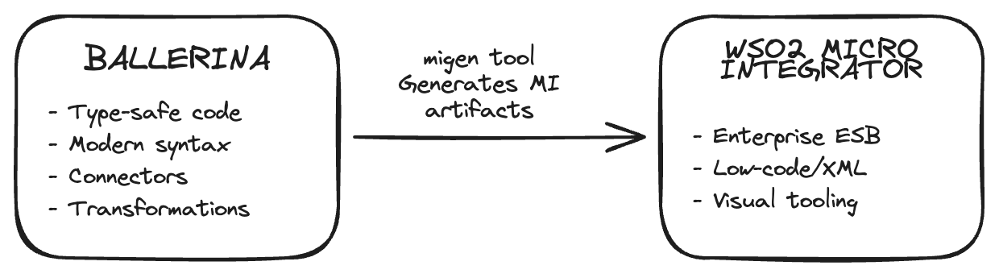
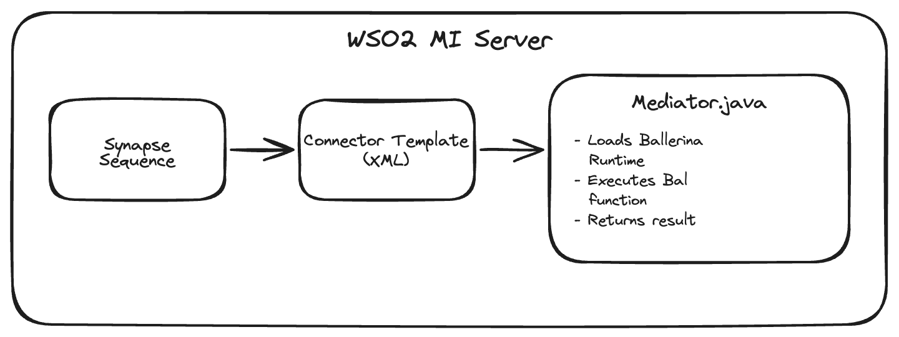
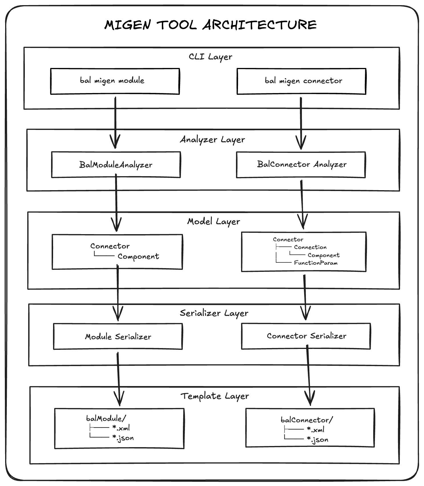

# Ballerina MiGen Tool Specification

## 1. Overview

The `migen` tool is a Ballerina CLI tool that generates WSO2 Micro Integrator (MI) artifacts from Ballerina source code. It enables developers to write integration logic in Ballerina and deploy it to WSO2 MI.

### 1.1 Purpose

The tool bridges two integration platforms:



### 1.2 Supported Generation Modes

| Mode | Command | Input | Output |
|------|---------|-------|--------|
| Module | `bal migen module` | Ballerina functions with `@mi:Operation` | MI module ZIP |
| Connector | `bal migen connector` | Ballerina Client class | MI connector ZIP |

---

## 2. Installation

### 2.1 Pull from Ballerina Central

```bash
bal tool pull migen
```

### 2.2 Verify Installation

```bash
bal migen --version
bal migen --help
```

---

## 3. Module Generation

### 3.1 Overview

Generates MI modules from Ballerina functions annotated with `@mi:Operation`. These modules can be invoked from MI sequences.

### 3.2 Command

```bash
bal migen module --path <path_to_ballerina_project> -o <output_directory>
```

### 3.3 Options

| Option | Description | Default |
|--------|-------------|---------|
| `--path` | Path to Ballerina project | Current directory |
| `-o, --output` | Output directory | `<path>/target/mi/` |
| `-h, --help` | Show help | - |

### 3.4 Ballerina Source Requirements

```ballerina
import wso2/mi;

@mi:Operation
public function calculateGPA(xml rawMarks, xml credits) returns xml {
    // Transformation logic
}

@mi:Operation
public function transformOrder(json orderData) returns json {
    // Business logic
}
```

### 3.5 Generated Artifacts

```text
<module-name>-module-<version>.zip
├── connector.xml              # Root module definition
├── functions/
│   ├── component.xml          # Lists all operations
│   ├── calculateGPA.xml       # Synapse template
│   └── transformOrder.xml     # Synapse template
├── uischema/
│   ├── calculateGPA.json      # UI schema for Integration Studio
│   └── transformOrder.json    # UI schema for Integration Studio
├── lib/
│   ├── <module>.jar           # Compiled Ballerina code
│   └── dependencies...        # Required JARs
└── icon/
    └── icon-small.png
```

### 3.6 MI Usage

```xml
<sequence name="ProcessGPASequence">
    <call-template target="calculateGPA">
        <with-param name="rawMarks" value="{$ctx:marks}"/>
        <with-param name="credits" value="{$ctx:credits}"/>
    </call-template>
</sequence>
```

---

## 4. Connector Generation

### 4.1 Overview

Generates MI connectors from Ballerina connector bala packages (Client classes). These connectors can be used in MI sequences to call external APIs.

### 4.2 Command

```bash
# From Ballerina Central
bal migen connector --package <org>/<name>:<version>

# From local project
bal migen connector --path <path_to_connector_project> -o <output_directory>
```

### 4.3 Options

| Option | Description | Default |
|--------|-------------|---------|
| `--path` | Path to local Ballerina connector bala | Current directory |
| `--package` | Ballerina Central package (e.g., `ballerinax/gmail:4.0.0`) | - |
| `-o, --output` | Output directory | `<path>/target/mi/` |
| `-h, --help` | Show help | - |

### 4.4 Ballerina Source Requirements

The tool analyzes Ballerina Client classes:

```ballerina
public isolated client class Client {

    # Initialize the Gmail connector
    public isolated function init(ConnectionConfig config) returns error? {
        // Initialization logic
    }

    # Send an email message
    remote function sendMessage(string userId, Message message) returns Message|error {
        // Implementation
    }

    # Get a draft by ID
    remote function getDraft(string userId, string draftId) returns Draft|error {
        // Implementation
    }
}
```

### 4.5 Generated Artifacts

```text
<org>-<connector>-connector-<version>.zip
├── connector.xml              # Root connector definition
├── functions/
│   ├── component.xml          # Lists all operations
│   ├── sendMessage.xml        # Synapse template
│   └── getDraft.xml           # Synapse template
├── config/
│   ├── component.xml          # Config component definition
│   └── init.xml               # Init template with connection params
├── uischema/
│   ├── sendMessage.json       # UI schema per operation
│   ├── getDraft.json          # UI schema per operation
│   └── gmail_Client.json      # UI schema for connection config
├── lib/
│   ├── gmail.jar              # Compiled Ballerina connector
│   └── dependencies...        # Required JARs (HTTP, OAuth, etc.)
└── icon/
    └── icon-small.png
```

### 4.6 Artifact Specifications

#### 4.6.1 connector.xml

```xml
<?xml version="1.0" encoding="UTF-8"?>
<connector>
    <component name="gmail" package="io.ballerina.stdlib.mi">
        <dependency component="config"/>
        <dependency component="functions"/>
        <description>Gmail connector for WSO2 MI</description>
    </component>
    <icon>icon/icon-small.png</icon>
    <displayName>gmail</displayName>
</connector>
```

#### 4.6.2 functions/{operation}.xml (Synapse Template)

```xml
<?xml version="1.0" encoding="UTF-8"?>
<template xmlns="http://ws.apache.org/ns/synapse" name="sendMessage">
    <parameter name="responseVariable" description="Output variable name"/>
    <parameter name="overwriteBody" description="Replace message body"/>
    <parameter name="userId" description="Gmail user ID"/>
    <parameter name="message" description="Message to send"/>

    <sequence>
        <property name="param0" value="userId"/>
        <property name="paramType0" value="string"/>
        <property name="param1" value="message"/>
        <property name="paramType1" value="record"/>
        <property name="functionType" value="REMOTE"/>

        <class name="io.ballerina.stdlib.mi.BalConnectorFunction">
            <property name="orgName" value="ballerinax"/>
            <property name="moduleName" value="gmail"/>
            <property name="version" value="4"/>
        </class>
    </sequence>
</template>
```

#### 4.6.3 uischema/{operation}.json

```json
{
  "connectorName": "gmail",
  "operationName": "sendMessage",
  "title": "Send Message",
  "help": "Send an email message",
  "elements": [
    {
      "type": "attributeGroup",
      "value": {
        "groupName": "General",
        "elements": [
          {
            "type": "attribute",
            "value": {
              "name": "configRef",
              "displayName": "Connection",
              "inputType": "connection",
              "allowedConnectionTypes": ["gmail_Client"],
              "required": "true",
              "helpTip": "Connection to be used"
            }
          },
          {
            "type": "attributeGroup",
            "value": {
              "groupName": "Input Variables",
              "elements": [
                {
                  "type": "attribute",
                  "value": {
                    "name": "userId",
                    "displayName": "User ID",
                    "inputType": "string",
                    "required": "true",
                    "helpTip": "Gmail user ID"
                  }
                }
              ]
            }
          }
        ]
      }
    }
  ]
}
```

### 4.7 MI Usage

```xml
<!-- Initialize connection -->
<gmail.init configKey="GmailConnection">
    <clientId>{$ctx:clientId}</clientId>
    <clientSecret>{$ctx:clientSecret}</clientSecret>
    <refreshToken>{$ctx:refreshToken}</refreshToken>
</gmail.init>

<!-- Call operation -->
<gmail.sendMessage>
    <userId>me</userId>
    <message>{$ctx:emailMessage}</message>
    <responseVariable>result</responseVariable>
</gmail.sendMessage>
```

### 4.8 Runtime Architecture



---

## 5. Architecture

### 5.1 Tool Architecture



### 5.2 Runtime Components

| Component | Class | Description |
|-----------|-------|-------------|
| Mediator | `io.ballerina.stdlib.mi.Mediator` | Invokes Ballerina functions from MI sequences |
| BalConnectorFunction | `io.ballerina.stdlib.mi.BalConnectorFunction` | Handles connector operations with connection state |

---

## 6. Version Compatibility

| Tool Version | wso2/mi Connector | Ballerina Version | Java Version | WSO2 MI Version |
|--------------|-------------------|-------------------|--------------|-----------------|
| 0.2 | 0.2 | 2201.10.3 | 17 | 4.2.0, 4.3.0 |
| >= 0.3 | 0.3 | 2201.12.7 | 21 | >= 4.4.0 |
| >= 0.4.1 | 0.4.1+ | 2201.13.x | 21 | >= 4.4.0 |

---

## 7. Error Handling

### 7.1 Generation Errors

| Error | Cause | Resolution |
|-------|-------|------------|
| `No Client class found` | No Ballerina Client class in project | Add a Client class with remote functions |
| `Invalid package format` | Incorrect `--package` format | Use format `org/name` or `org/name:version` |
| `Failed to download package` | Network or package not found | Check network and package name |
| `Path traversal detected` | Malicious input in package identifier | Use valid package identifiers |

### 7.2 Runtime Errors

| Error | Cause | Resolution |
|-------|-------|------------|
| `BALLERINA_EXECUTION_ERROR` | Ballerina function threw error | Check Ballerina code and input parameters |
| `Module not found` | JAR not in MI classpath | Deploy connector ZIP to MI |

---

## 8. Security Considerations

### 8.1 Input Validation

- Package identifiers (org, name) are validated against `^[a-zA-Z_][a-zA-Z0-9_.-]*$`
- Version strings are validated as semantic versions
- Path traversal characters (`..`, `/`, `\`) are rejected

### 8.2 Zip Extraction

- Zip entries are normalized and validated to prevent zip slip attacks
- Extracted paths must remain within the target directory

---

## 9. References

- [Ballerina Language](https://ballerina.io/)
- [WSO2 Micro Integrator](https://wso2.com/micro-integrator/)
- [Ballerina Central](https://central.ballerina.io/)
- [WSO2 MI Connectors](https://store.wso2.com/store/assets/esbconnector/list)
